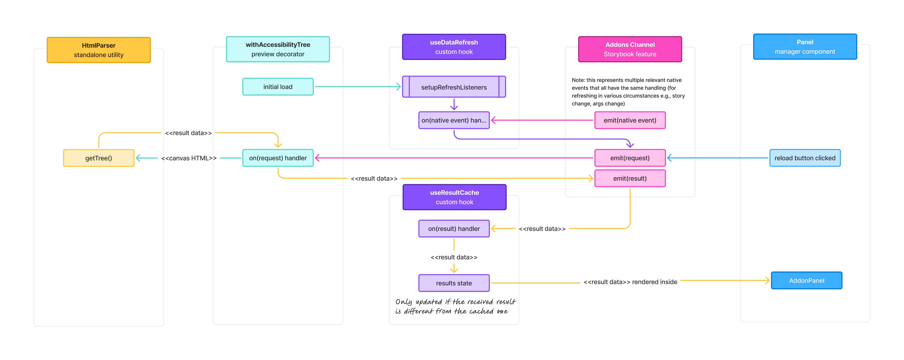

# Storybook Accessibility Tree Addon - Developer Notes

## Table of Contents
- [Overview](#overview)
- [Setup](#setup)
- [Dev mode](#dev-mode)
- [Troubleshooting](#troubleshooting)
- [Resources](#resources)

---
## Overview

Below is a diagram illustrating the flow of events and data, as at version 1.0.0-alpha of the addon.

A non-image, more accessible version of the diagram is still to come.

## Setup

After forking/cloning this repository, run `pnpm install` to install project dependencies.

Ensure you have [Sass](https://sass-lang.com/install) installed globally and available on the command line to compile the component styles.

Then you can run, build, and/or test with the following commands:

| Command               | Description                                                                                                  |
|-----------------------|--------------------------------------------------------------------------------------------------------------|
| `pnpm run dev`        | Runs Storybook in an enhanced dev mode (see below for details)                                               |
| `pnpm run start`      | Runs babel in watch mode and starts Storybook using the built addon code                                     |
| `pnpm run build`      | Builds and packages the addon code                                                                           |
| `pnpm run test`       | Runs all unit tests                                                                                          |
| `sass src/components` | Compiles component CSS files (from SCSS). Alternatively, set up a File Watcher in WebStorm to automate this. |

## Dev mode

Running with `pnpm run dev` does the following:
- sets the `STORYBOOK_DEBUG` environment variable
- runs Storybook in dev mode (the same as in `start` mode, but now debugging is enabled)
- Logs all Storybook preview events to the browser console (debug tab)
- loads the addon's source code directly instead of the built version in `local-preset.ts`, which provides better source mapping for preview-related files and a faster feedback loop due to the lack of build step.

> \[!NOTE]
> Hot reloading doesn't work for changes made to `.storybook/main.ts`, `./storybook/local-preset.ts`, or `.storybook/manager.ts` or any components loaded into the manager UI. You will need to restart Storybook to see changes to these files regardless of whether you're running in dev mode or not.

## Troubleshooting

| Issue                                                         | Solution                                                                                                                                                                                                                                                    |
|---------------------------------------------------------------|-------------------------------------------------------------------------------------------------------------------------------------------------------------------------------------------------------------------------------------------------------------|
| Changes to the addon code not reflecting in test Storybook    | Rebuild and restart to manually refresh. In particular, changes to files in the `.storybook` directory and for manager-related files (as opposed to preview-related files) definitely require a restart in dev mode, or rebuild + restart in other modes.   |
| `npm run start` erroring with "module not found"              | Use `pnpm` instead of `npm` and/or run `npm run build:watch` + `npm run storybook` separately (or `pnpm` equivalents).                                                                                                                                      |
| Browser console logging doesn't reference the correct TS file | Run with `pnpm run dev` to load the addon's source code directly instead of the built version in `local-preset.ts`. Note: `console.log`s in manager components will unfortunately still resolve to `manager-bundle.js` because of how Storybook loads them. |

## Resources

For more information about developing addons, see:
- [Addon kit template repo](https://github.com/storybookjs/addon-kit)
- [Addon development docs](https://storybook.js.org/docs/addons/writing-addons)
- [Addon Knowledge Base](https://storybook.js.org/docs/addons/addon-knowledge-base)
- [Storybook UI components](https://main--5a375b97f4b14f0020b0cda3.chromatic.com)
- [Storybook Icons](https://main--64b56e737c0aeefed9d5e675.chromatic.com/)
- [React Aria library](https://react-aria.adobe.com/) - where the tree component used in this addon's panel comes from